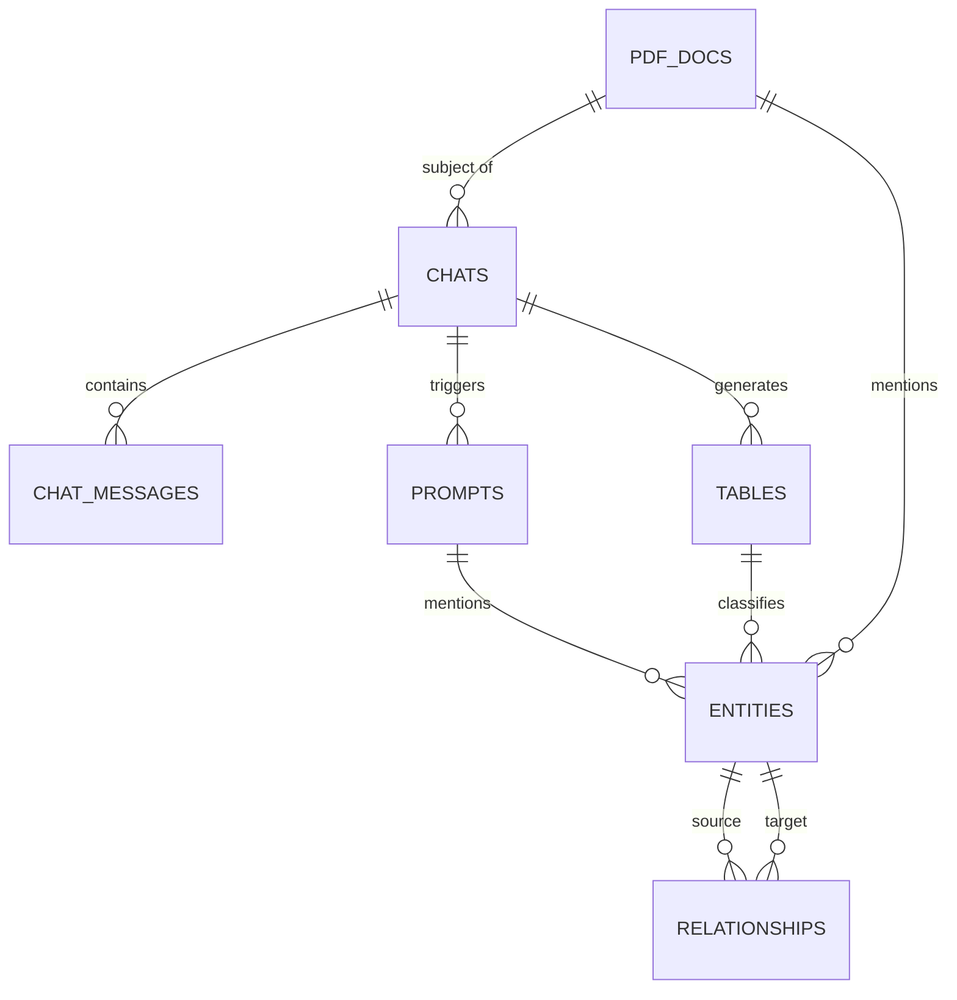
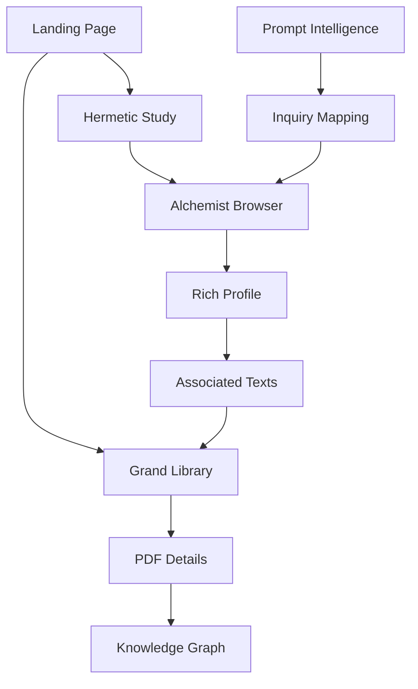

# Feature Map & Scholarly Architecture (V9.5)

This report documents the "Mansion" as a dataset, visualizing the connections between its rooms and the underlying database schema.

---

## 🗺️ The Mansion ERD (Entity-Relationship Diagram)
This diagram shows how your primary sources (PDFs), scholarly inquiries (Prompts), and extracted data (Tables/Entities) are connected.

---

## 🚪 Room audit: Features & Goals

### 1. The Grand Library (`library.html`)
- **Feature**: PDF browsing with "Thick" bibliographical metadata.
- **DH Goal**: Accessibility & Provenance.
- **User Flow**: Browse -> Select PDF -> View Summary -> Link to associated Graphs/Chats.

### 2. The Alchemical Lab (`alchemy.html`)
- **Feature**: Frequency-based visualizations of alchemical terms.
- **DH Goal**: Pattern Discovery & Distant Reading.
- **User Flow**: View Trends -> Click Term -> Open Dictionary Entry.

### 3. The Hermetic Study (`hermetic.html`)
- **Feature**: The "Golden Chain" D3.js lineage visualizer.
- **DH Goal**: Intellectual Historiography (Lineage).
- **User Flow**: Observe Chain -> Hover Epoch -> Read Biographical Drawer.

### 4. The Tables Laboratory (`tables.html`)
- **Feature**: Accordion-based viewer for structured data extracted from chats.
- **DH Goal**: Data Synthesis & Comparison.
- **User Flow**: Filter by Topic -> Expand Table -> Compare across Chats.

### 5. Prompt Intelligence (`prompts.html`)
- **Feature**: Reflexive analysis of the user's scholarship.
- **DH Goal**: Meta-Research (The Scholar's Path).
- **User Flow**: View Strategy -> See Mentions -> Pivot to Alchemist Browser.

### 6. The Lessons Lab (`lessons.html`)
- **Feature**: 100 codified architectural and DH lessons.
- **DH Goal**: Reflexivity & Methodological Transparency.
- **User Flow**: Search Lesson -> View Designer Insight -> Apply to future "Dungeons".

---

## 🔄 User Interface Flowchart
How a scholar is expected to traverse the mansion.

---

## 📊 The "Database as a Dataset" Philosophy
Every feature added (like the 100 Lessons) is ingested into the `entities` table. This allows the database to "know itself".
- **Self-Documenting**: The code structure is mirrored in the `design.html` dashboard.
- **Historiographical Haunting**: We measure popularity not just in the books, but in *your* interactions with the books.
